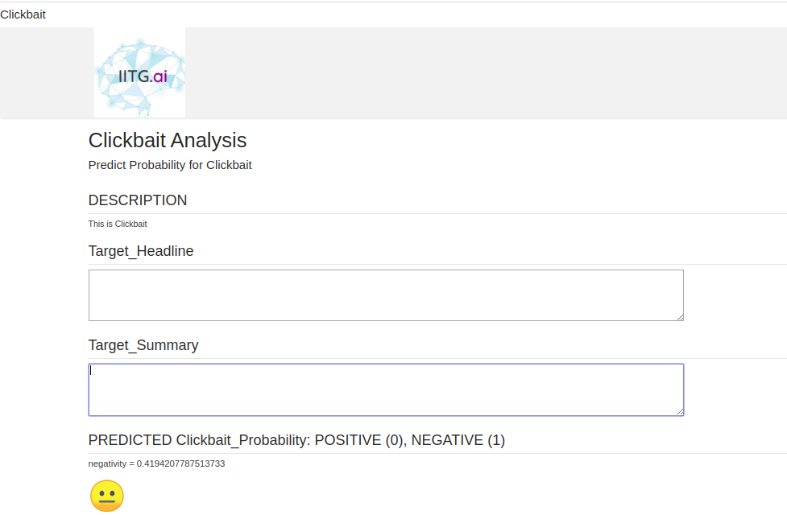

# Fake_News_Web

# Click bait in the broswer preview

This is a project for detecting click bait IITG.ai
## Introduction

clickbat is defined as content whose main purpose is to attract attention and encourage visitors to click on a link to a particular web page.
We wanted to enable click bait analysis in the browser.. Refer to the competition site to see description about challenge [here](https://www.clickbait-challenge.org/)

## Data

The dataset can be found [here](https://drive.google.com/drive/folders/1YESJbDd6eN2iexOWB-D2VlRKRYRQQa7T?usp=sharing)

## Code

This code was written and trained on Google colab.

### Dependencies
* tensorflow 2.0+ is required
* need to install ktrain 

   `pip install ktrain` 
* pandas 0.25+
* sklearn 0.21+

### Training
Paste the dataset downloaded in the folder
`data/`
Additionally you can import it from drive if you are using colab. 

### Testing 
 test = statement + '<>' + description  
 
 `predictor.predict(test)` 
 
 will give the result 
 
 You can check the notebook cells for the above
  

## Description 

## Conclusion

Our model has huge future prospects and can be
easily scaled. The Political Fake News is currently
trained on the US dataset where fake news was the
main topic of the US election 2016 and the problem is
expected to grow in India as well. The future work
would extend this to an Indian dataset .
