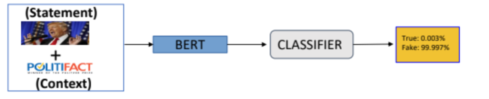

# Fake News Detection

Fake News is a spread of disinformation and hoaxes through any news platform. The imminent threat of such a widespread misinformation is obvious and hence we have looked into ways in which such Fake News can be identified with the help of Artificial Intelligence. Fake News Detection and analysis is an open challenge in AI!

- The main question is what exactly constitutes Fake News?

## Types of Fake News identified:

### Political Fake News:

- The statement and justification approach is used.The statement is a direct quote from a public personality. The justification is the context or background information for the statement. Justification is important as the statement on its own doesn’t imply anything in regard to it being False or True.

### Clickbait:
- Another source of Fake News is a click bait scenario. Where the headline has no relation with the actual content and is just used to spike reader interest.

### Fake News Articles:
- Some fake articles have relatively frequent use of terms seemingly intended to inspire outrage and the present writing skill in such articles is generally considerably lesser than in standard news.

## Techniques

We divide our technique into 3 categories
- <ins>**Politcal Fake News**</ins>: 

The LIAR-PLUS Dataset along with additional data scraped from Politifact website was used by taking training size to 20,000 examples. 
We have concatenated the statement and description by a sentence. Given enough training examples the model learns to make inference on statements given a justification and we got the best accuracy by BERT uncased large model of 70 % on test set.

- <ins>**Clickbait**</ins>: We have used BILSTM attention model and fine-tuned it using a dataset of train size 19,000 examples.

- <ins>**Fake News Article**</ins>: Custom made dataset collected form politifactMediabias chart. To find out if this hypothesis is correct, we made a labelled data set that will give us examples of fake news and examples of real news as provided by professional fact checkers. We scraped data from the urls and pre processing is done using NLTK, we fine tuned BERT to predict the news article as real or fake.

## Results
The results obtained for each model are as follows:
- <ins>**Political Fake News**</ins>: Out of all the model architectures we tried, the architecture with the best accuracy was with BERT with an accuracy of 70% on the test set. This surpasses the accuracy outlined in the paper.
- <ins>**Clickbait**</ins>: We used the dataset given in clickbait challenge and applied and fine-tuned LSTM attention model to give 76 % accuracy on test set.
- <ins>**Fake News Articles**</ins>: We used fine tuned BERT on our model trained on custom dataset. Our is performing with an accuracy of 81%.

## Conclusion 

- <ins>**Political Fake News**</ins>: Our model has huge future prospects and can be easily scaled. The Political Fake News model is currently trained on the US dataset where fake news was the main topic of the US election 2016 and the problem is expected to grow in India as well. The future work would extend this to an Indian dataset .
- <ins>**Clickbait**</ins>: In social media, headlines are exaggerated whose main motive is to mislead the reader. This creates a nuisance for the online user.
- <ins>**Fake News Articles**</ins>: The model identifies patterns and can identify patterns in unreal data. The model only requires a working URL to work.
